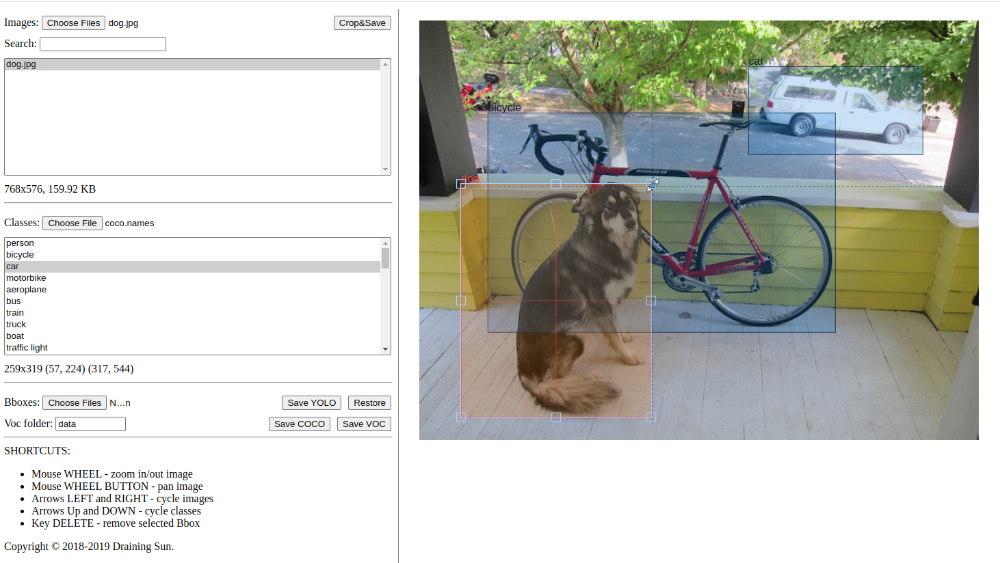

# YOLO BBox Annotation Tool - https://lddl.github.io/yolo-ann

Fork of https://github.com/drainingsun/ybat

Fast and efficient BBox annotation for your images in YOLO, and now, VOC/COCO formats!

## USAGE

### Online

1. Navigate to https://lddl.github.io/yolo-ann/
2. Load images and classes and start bboxing!

### Offline

<details>
<summary>Click to expand</summary>

1. Download repository

    ```shell
    git clone https://github.com/LdDl/yolo-ann.git
    ```

2. Navigate to root folder

    ```shell
    cd yolo-ann
    ```

3. Open `index.html` in your browser.

4. Load images and classes and start bboxing!

5. Optional configuration:

    5.1. Open index.js.

    5.2. Edit section named `parameters`.

</details>

UI should look something like this:



## Differences from original repository
Main differences are:
* Using `FabricJS` instead of unnamed one. Tons of changes have been done, if you find a bug, please open an issue or open a pull request.
* Updated version of `jszip`
* Updated version of `FileSaver.js`
* Panning is done via wheel button
* Accept *.names, *.csv and *.txt extensions for classnames file


## Compatibility
All browsers that support ES6 should work. Tested with:

* Chrome v65
* Firefox v58
* Safari v11
* Opera v51

No idea about IE/Edge.

## Dependencies 

|Package|Notes|Licence|
|-------|-----|-------|
|[FileSaver.js](https://github.com/eligrey/FileSaver.js)| - |[FileSaver.js license](https://github.com/eligrey/FileSaver.js/blob/master/LICENSE.md)|
|[jszip](https://stuk.github.io/jszip)| - |[MIT](https://github.com/Stuk/jszip/blob/main/LICENSE.markdown)|
|[FabricJS](https://github.com/fabricjs/fabric.js#fabricjs)| Used instead of some legacy [unidentified library from original repository](https://github.com/drainingsun/ybat/blob/master/canvas.min.js)|[FabricJS license](https://github.com/fabricjs/fabric.js/blob/master/LICENSE)|


## Feature
* Basic Pascal VOC and COCO format support.
* Works in your browser on any platform.
* Complete YOLO format support.
* No need for image upload - everything is done locally!
* Zooming and panning images with guidelines for precise bboxing.
* Fast navigation for quick bboxing.
* Auto save in memory in case of accidental refreshes and crashes.
* Ability to crop your bboxes and save the resulting images.
* Information on both image and current bbox.

## Caveats
* Loading many and or big images might take a while. This is because tool needs to figure out image dimensions.  
* Cropping many items might crash your browser. This and above will be fixed at some point.
